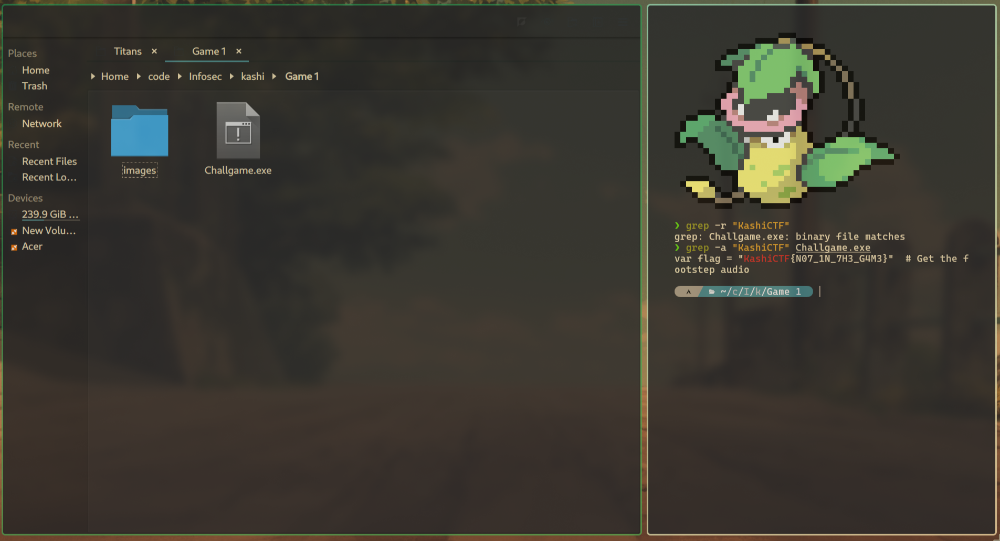
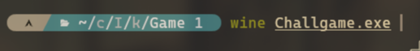
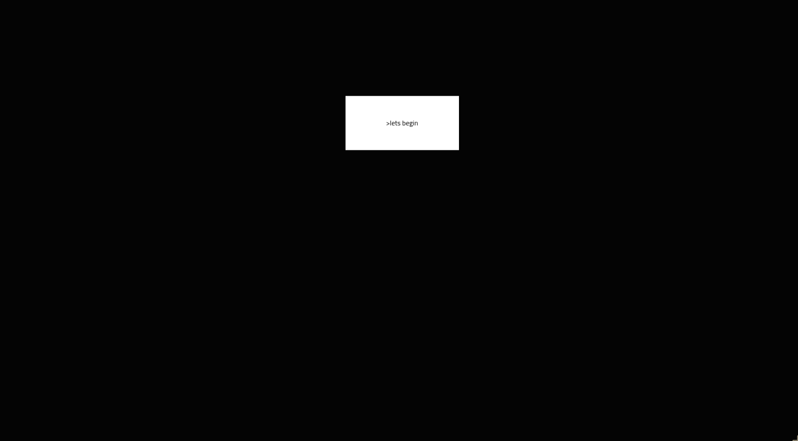
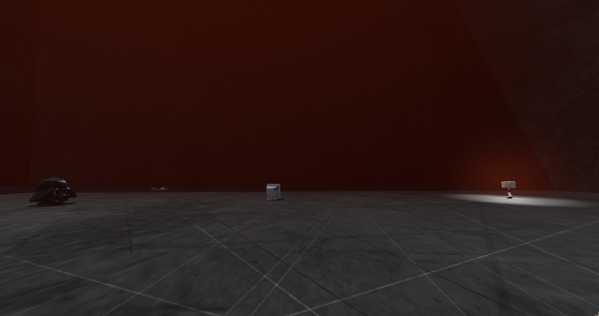

# Game 1 - Untitled Game 🎮

**Final Points:** 100


## Description
We made a game.


Flag format: `KashiCTF{your_flag_here};`

## Link -
 [Drive Link](https://drive.google.com/file/d/1bf4WnxE81YIizN2e77x5PrkqGPwllgki/view?usp=drive_link) {Download the game from here} ==> `Challgame.exe`

----
## Writeup

On downloading the files, I ran the command 
```
grep -r "KashiCTF{"
```
Which showed that this string existed inside the binary `Challgame.exe`

so I ran 
```
grep -a "KashiCTF{" Challgame.exe
```

Which gave the flag.


---
## The Game

I ran it using wine.
 


It was a simple same where the objective was to escape the trap.



on clicking let's begin


---
## Flag

```
KashiCTF{N07_1N_7H3_G4M3}
```                 

