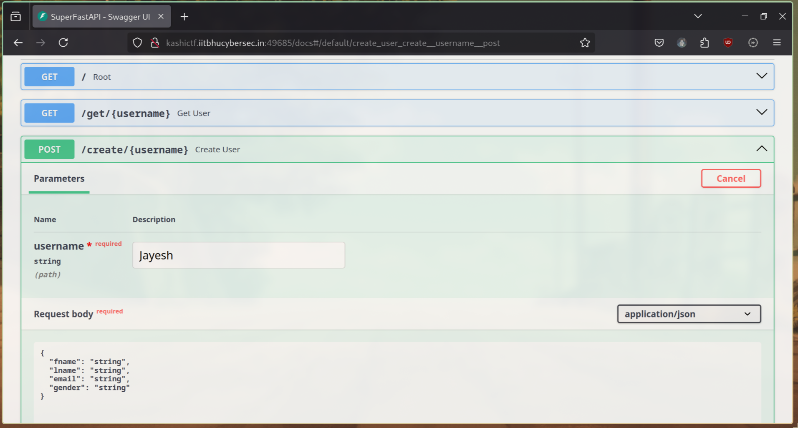

# SuperFastAPI ⚡

**Final Points:** 100


## Description
Made my very first API!

However, I have to still integrate it with a Frontend so can't do much at this point lol.


Flag format: `KashiCTF{your_flag_here};`

## Instance
``http://kashictf.iitbhucybersec.in:port/``

----
## Writeup

On analyzing the website it was a simple api app with no frontend


Then I changed the URL to search for `/robots.txt` or `/.git/` for some hidden instructions, as I got nothing from the sources and application tab on developer tools or even from burp suite. 

 This made me use a Fuzzer like `gobuster` or an [Online URL fuzzer](https://pentest-tools.com/website-vulnerability-scanning/discover-hidden-directories-and-files) 

where I found:


On digging deeper I reached ``http://kashictf.iitbhucybersec.in:port/docs/``
Which had OpenAPI service.



There on trying multiple things, I found that 
The flag was only visible to the ``admin``

But no user named admin existed.

I then created a user `admin`


but he was also denied the permission to get the flag,

And then I saw an update user tab

and thought of changing the attributes of admin user and also assign role to him.
```json
{
  "fname": "Admin",
  "lname": "_Admin",
  "email": "admin@admin.com",
  "gender": "male",
  "role": "admin"
}
```


Then I tried getting the flag from flag tab using `admin'

which was successful and gave 
```
        Requested URL
              http://kashictf.iitbhucybersec.in:port/flag/admin
```


on reaching there I got the flag.


---
## Flag

```
KashiCTF{your_flag_here}
```                 
