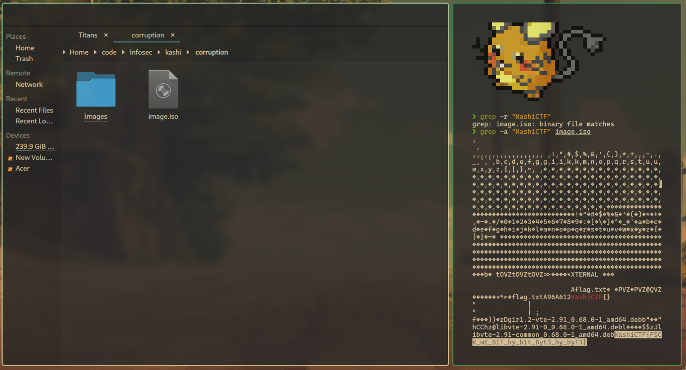

# Corruption :accessibility:

**Final Points:** 100


## Description
A corrupt drive I see...


Flag format: `KashiCTF{your_flag_here};`

## Link -
 [Download Link](https://drive.google.com/file/d/1gHY5DOmUcZvfrLr-EpQWJfR3oiVCsYtD/view?usp=sharing) {Download the game from here} ==> `image.iso`

----
## Writeup

On downloading the files, I ran the command 
```
grep -r "KashiCTF{"
```
Which showed that this string existed inside the binary `image.iso`

so I ran 
```
grep -a "KashiCTF{" image.iso
```

Which gave the flag.



---
## Flag

```
KashiCTF{FSCK_mE_B1T_by_b1t_Byt3_by_byT3}
```                 

