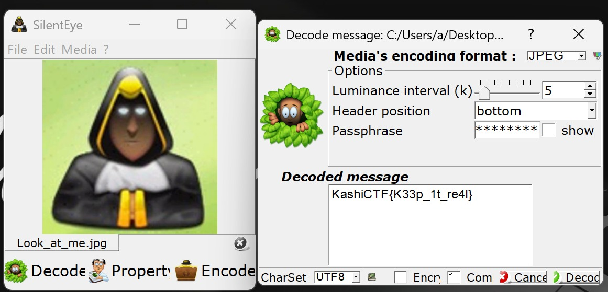

# Look at Me

**Final Points:** 304


## Description
There is something wrong with him.. What can it be??
## Attachments 

+ [Look_at_me.jpg](./Look_at_me.jpg)


---
## Writeup

On carefully seeing the image, I found various black dots visible in the picture so I tried to search for the original image and while doing so I found *SilentEye: cross-platform application design for an easy use of steganography*. I downlaoded the tool and uploaded the picture and DECODE and there was the flag.




---
## Flag
```
KashiCTF{K33p_1t_re4l}
```