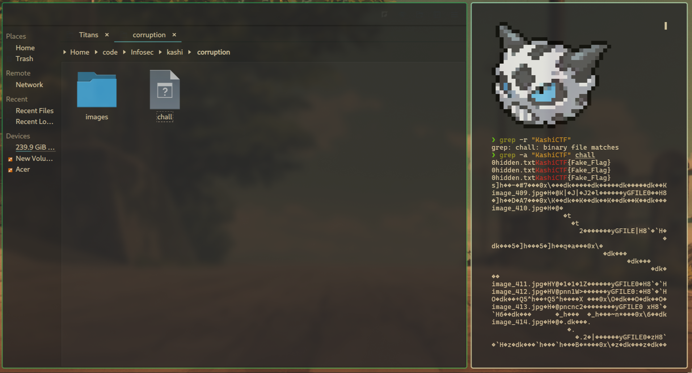
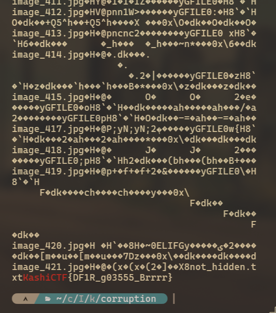

# Memories Bring Back You 🖼️

**Final Points:** 100


## Description
A collection of images, a digital time capsule—preserved in this file. But is every picture really just a picture? A photographer once said, “Every image tells a story, but some stories are meant to stay hidden.” Maybe it’s time to inspect the unseen and find what’s been left behind.


Flag format: `KashiCTF{your_flag_here};`

## Link -
 [Download Link](https://1drv.ms/u/c/dfdcc49b521e7a98/ERmqsxL1d7hMogyPb-5acNsBsBeZRLdgTSW98j5oJShi5Q?e=7oNUX4) {Download the game from here} ==> `chall`

----
## Writeup

On downloading the file, I ran the command 
```
grep -r "KashiCTF{"
```
Which showed that this string existed inside the binary `chall`

so I ran 
```
grep -a "KashiCTF{" chall
```


Which gave the flag.
 



---
## Flag

```
KashiCTF{DF1R_g03555_Brrrr}
```                 

