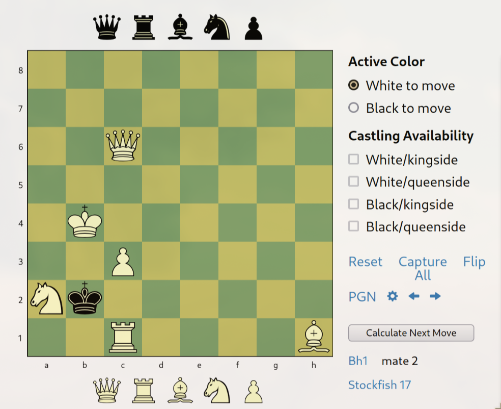
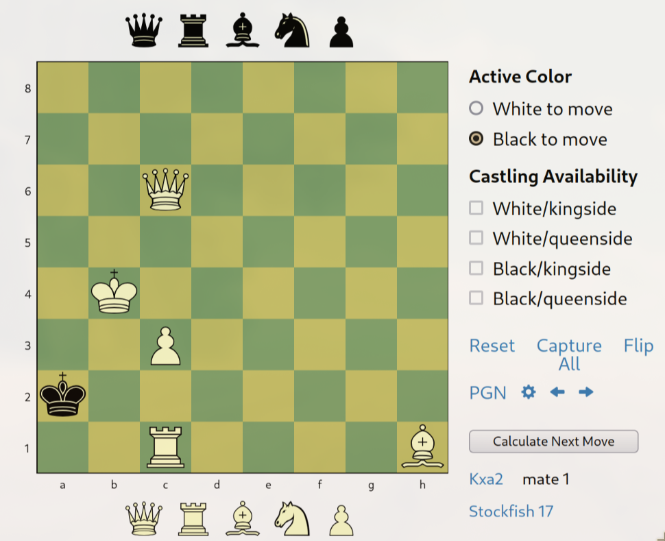
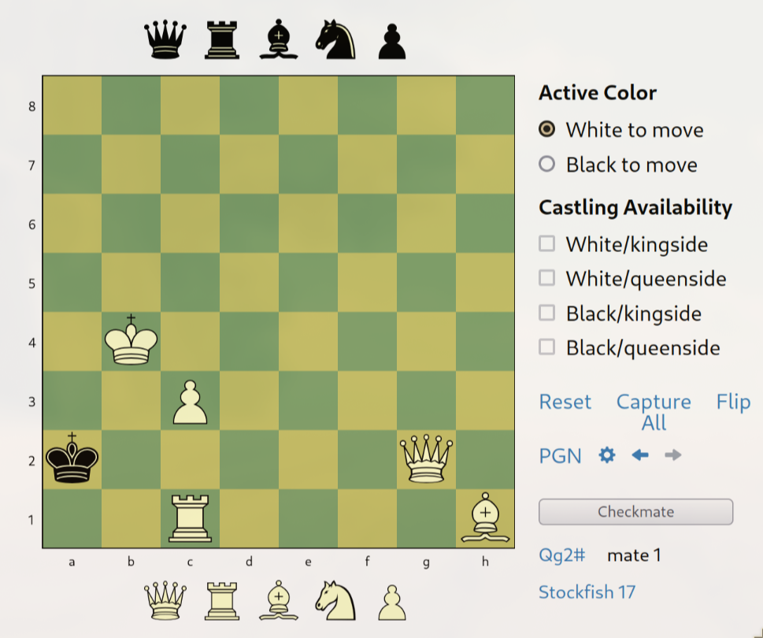

# Stego Gambit ♟️

**Final Points:** 480

*Author:* thievius

## Description
Do you dare to accept the Stego Gambit? I know you can find the checkmate but the flag!!


Flag format: `KashiCTF{your_flag_here};`

## Link -
 [Download Link](https://kashictf.iitbhucybersec.in/files/3a060c635d4403b0a30c877d46486899/chall.jpg?token=eyJ1c2VyX2lkIjo5LCJ0ZWFtX2lkIjoxMSwiZmlsZV9pZCI6MTd9.Z77Z2Q.ba_5ZTQraD5bETFN11SQzVO1fn0) {Download the game from here} ==> `chall.jpg`

----
## Writeup

On downloading the image, 


I ran exiftool on it to find something in its meta data and I got
```bash
> exiftool images/chall.jpg
ExifTool Version Number         : 13.21
File Name                       : chall.jpg
Directory                       : images
File Size                       : 49 kB
File Modification Date/Time     : 2025:02:22 17:44:18+05:30
File Access Date/Time           : 2025:02:26 14:41:27+05:30
File Inode Change Date/Time     : 2025:02:26 14:41:29+05:30
File Permissions                : -rw-r--r--
File Type                       : JPEG
File Type Extension             : jpg
MIME Type                       : image/jpeg
JFIF Version                    : 1.01
Resolution Unit                 : None
X Resolution                    : 1
Y Resolution                    : 1
Comment                         : Use the moves as a key to the flag, separated by _
Image Width                     : 817
Image Height                    : 815
Encoding Process                : Baseline DCT, Huffman coding
Bits Per Sample                 : 8
Color Components                : 3
Y Cb Cr Sub Sampling            : YCbCr4:2:0 (2 2)
Image Size                      : 817x815
Megapixels                      : 0.666
```

which had a hint in its comment
{Use the moves as a key to the flag, separated by _}

To find the set of moves for checkmate I used [Next Chess Move](https://nextchessmove.com/?fen=8/8/2Q5/3B4/1KP5/8/NkP5/2R5%20w%20-%20-%200%201)

Now, I had two choices,
- White to move first
- Black to move first

But after analyzing a bit, I saw that if black moves first, then it is a `stalemate`. Now, I knew that it was white's turn to move.

the set of moves were -
```
    White - Bh1
    Black - Kxa2 {only move}
    White - Qg2
    # - checkmate
```




so the passphrase is
```
Bh1_Kxa2_Qg2#
```
which on running with steghide, gives nothing
command and output
```
steghide extract -p Bh1_Kxa2_Qg2 -sf images/chall.jpg

steghide: could not extract any data with that passphrase!
```


so on thinking,

It was concluded that one move is when both white and black move once;
then the passphrase is
```
Bh1Kxa2_Qg2#
```
which on running with steghide, gave the flag in flag.txt
```
steghide extract -p Bh1_Kxa2_Qg2 -sf images/chall.jpg

steghide: could not extract any data with that passphrase!
```


on concatenating `flag.txt`
```bash
❯ cat flag.txt
KashiCTF{573g0_g4m617_4cc3p73d}
```

Which is the flag.


---
## Flag

```
KashiCTF{573g0_g4m617_4cc3p73d}
```                 
