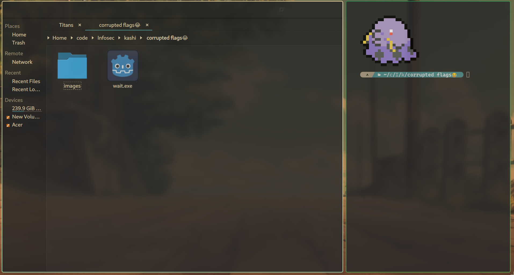
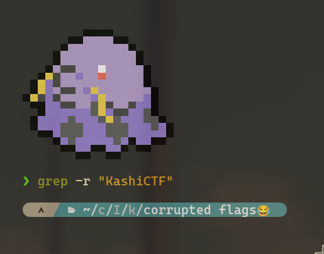
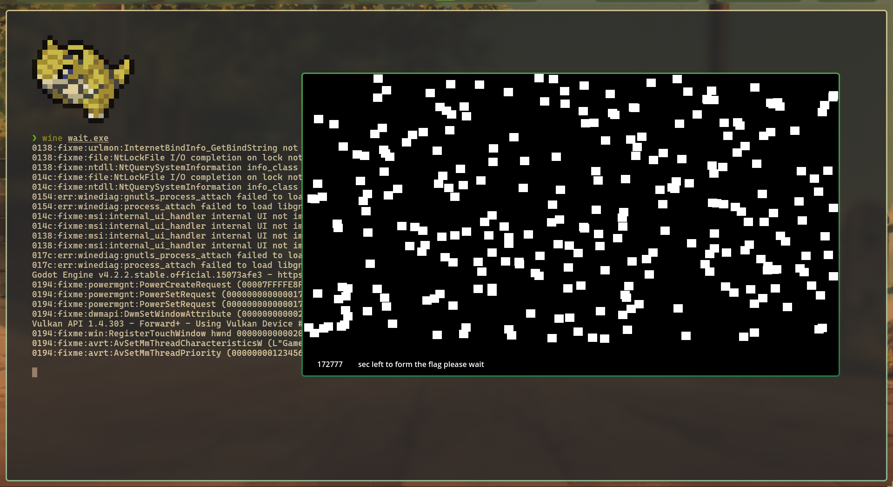
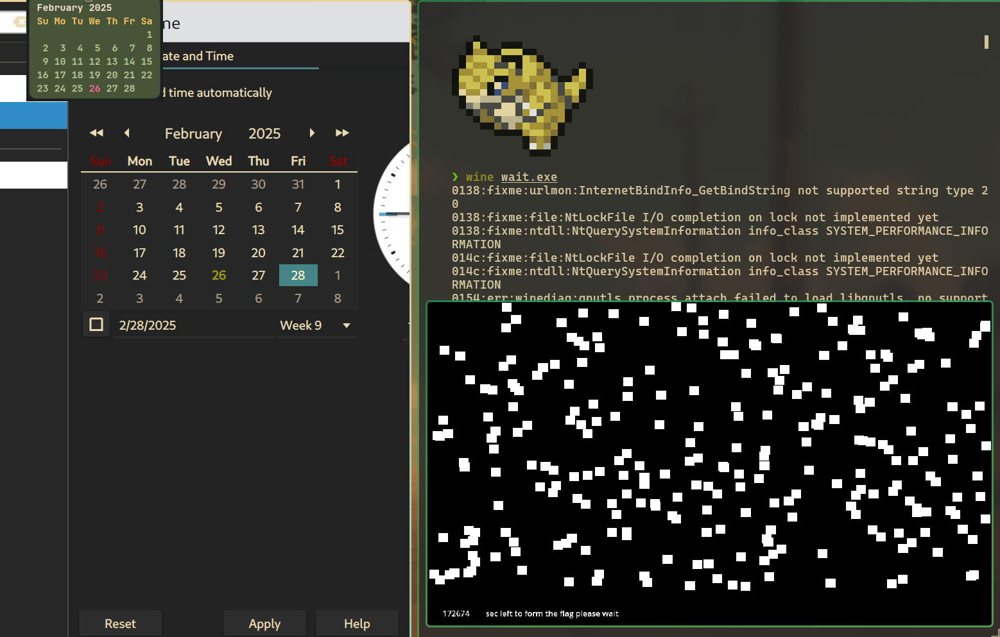
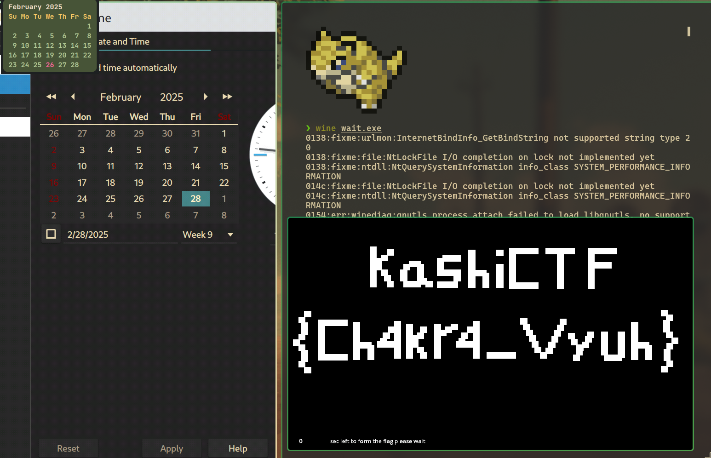

# Game 1 - Wait ⏰
**Final Points:** 195


## Description
We made a game.


Flag format: `KashiCTF{your_flag_here};`

## Link -
 [Drive Link](https://drive.google.com/file/d/1GDYmOiW54pPLFxfQaBOOS5IPEAoplFPy/view?usp=drive_link) {Download the game from here} ==> `wait.exe`

----
## Writeup

On downloading the game file,



The logo of the game was `sus`. 😆😆

I ran the command 
```
grep -r "KashiCTF{"
```
but got nothing from it.



Then I ran it using wine.



It was a simple game, and its objective was to wait for `48 hours` or `172800 Seconds` for the flag to be revealed.

I could have waited for the flag to be revealed automatically after 2 days but the CTF competition was for 24 hours only in itself.

So, now I could have used a tool like [Cheat Engine](https://www.cheatengine.org/) or just try changing the Date of my system to see if it works.



and after changing the date to 2 days later, I got



the flag !!!

It was very easy after all.

We could have also used Cheat engine to change the time_remaining attribute 

---
## Flag

```
KashiCTF{Ch4kr4_Vyuh}
```                 

