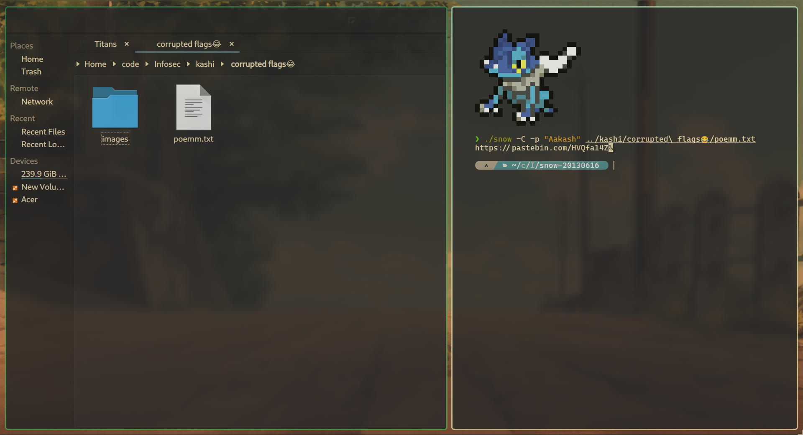
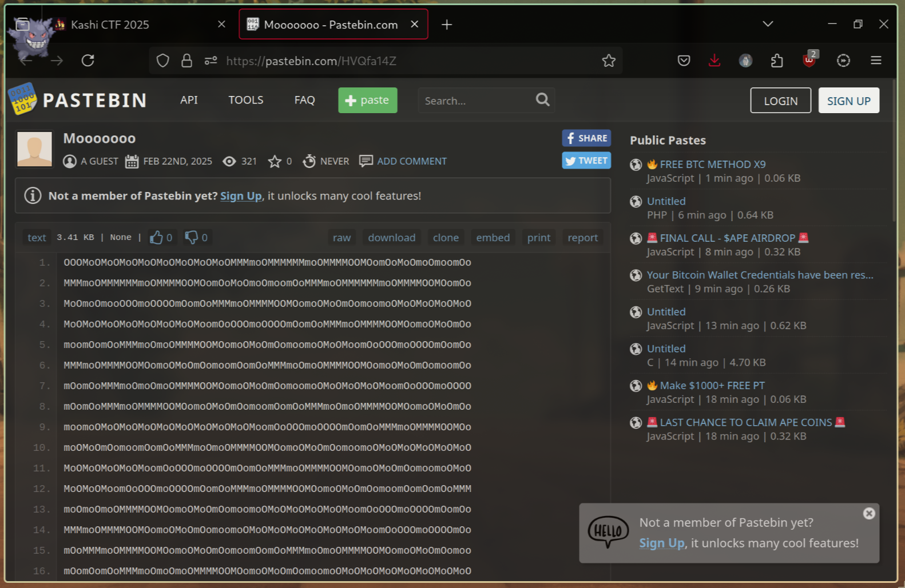
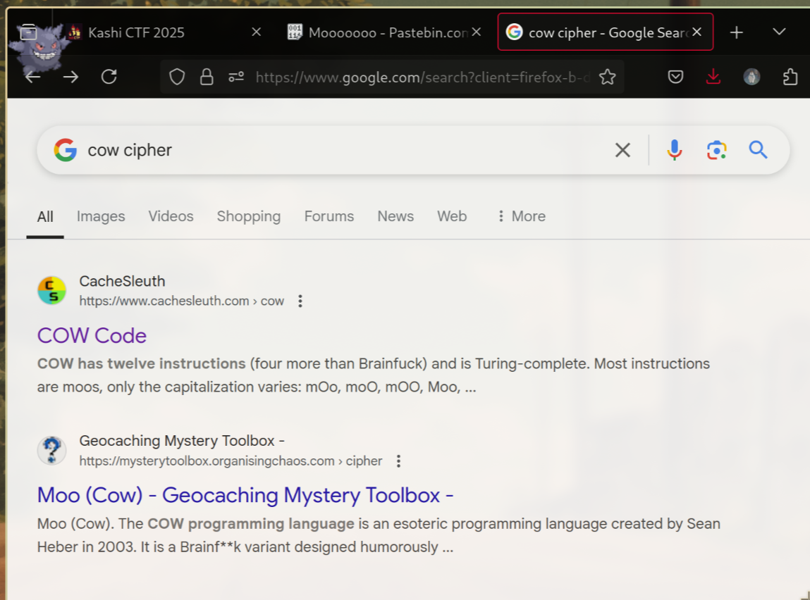
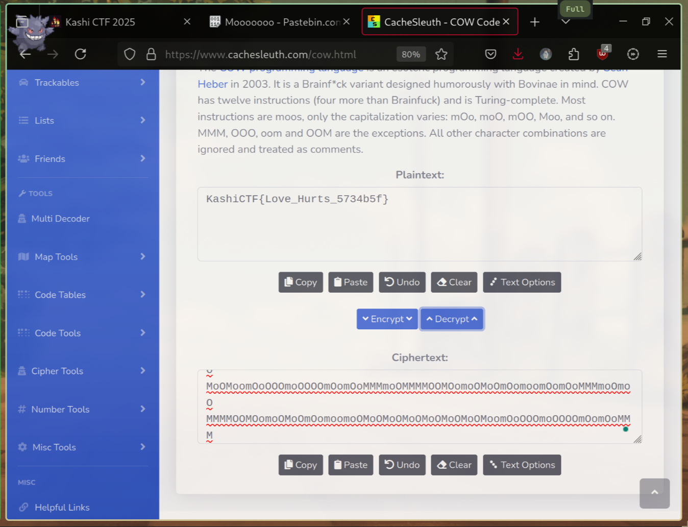

#   SNOWy Evening  ❄️

**Final Points:** 205


## Description
A friend of mine , Aakash has gone missing and the only thing we found is this poem...Weirdly, he had a habit of keeping his name as the password.

## Link -
 [Download Link](https://kashictf.iitbhucybersec.in/files/8f213d7d435a3de32e585e3e76c6700e/poemm.txt?token=eyJ1c2VyX2lkIjo5LCJ0ZWFtX2lkIjoxMSwiZmlsZV9pZCI6MjZ9.Z8Ctpw.tFNFUjzTv9zzF6MLTWFYIUplUsg) {Download the game from here} ==> `poemm.txt`

----
## Writeup

**poemm.txt** 

view [poemm.txt](poemm.txt)
```
Pity, in place of love,			       	       			  
That pettiest of gifts,      	     	    		      	       	       
Is but a sugar-coating over neglect. 		 	   	  	 
Any passerby can make a gift of it 	  	   	  	   	       
To a street beggar,   	    	       		    	     	  	   
Only to forget the moment the first corner is turned.   	 
I had not hoped for anything more that day.	 	      		   
       	  	   	 	      	  	  	   	       	      
You left during the last watch of night.   		  		 
I had hoped you would say goodbye,     	   	     	 	     	 
Just say ‘Adieu’ before going away,  	 
What you had said another day,
What I shall never hear again.
In their place, just that one word,
Bound by the thin fabric of a little compassion
Would even that have been too much for you to bear?

When I first awoke from sleep
My heart fluttered with fear
Lest the time had been over.
I rushed out of bed.
The distant church clock chimed half past twelve
I sat waiting near the door of my room
Resting my head against it,
Facing the porch through which you would come out.
```
From the title of the Question, I got a hint of the word `snow` on searching a bit, I got to know about [stegsnow](https://wiki.bi0s.in/steganography/stegsnow/)

**Installation**

for [Ubuntu/Debian](https://wiki.bi0s.in/steganography/stegsnow/)

and [I use Arch btw ...](https://darkside.com.au/snow/) --> use tar and use `make` 

Then the command I used
```
stegnow -C -p "Aakash" poemm.txt
```
OR

from where you installed snow
```
./snow path_to_file/poemm.txt
```


The output I got--
```
https://pastebin.com/HVQfa14Z
```

Which was a [pastebin link](https://pastebin.com/HVQfa14Z)



On analyzing it, it looked like something a cow would say -- `moooo`

so I searched for cow cipher/encryption and got this [link](https://www.cachesleuth.com/cow.html)



on pasting the long cow speech and derypting it we finally got the flag!!



`yay -S done`

---
## Flag

```
KashiCTF{Love_Hurts_5734b5f}
```                 

