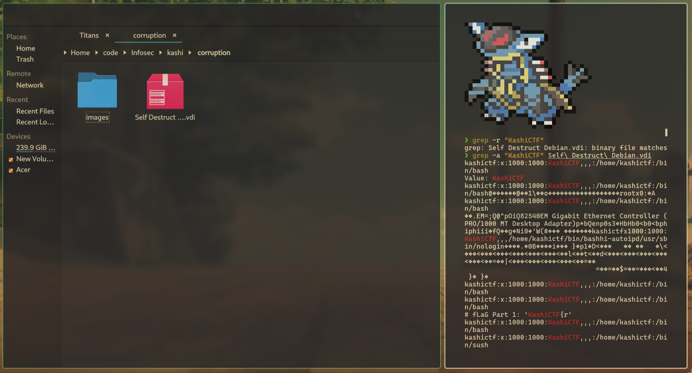
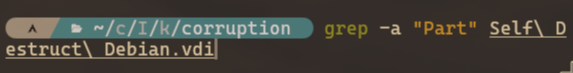
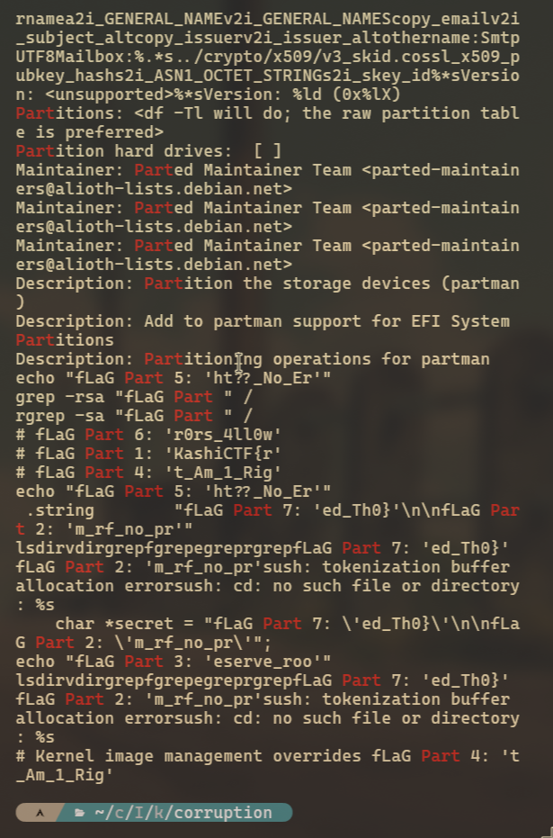

#  Self Destruct 💣

**Final Points:** 347


## Description
Explore the virtual machine and you might just find the flag. Or a surprise. Maybe....

NOTE: The attachment is a VirtualBox image. Do not run it outside VirtualBox. It is recommended to backup the .vdi file before launching the VM.

VM Parameters: (VirtualBox)
Type: Linux
Version: Debian (32 bits)
RAM: 1024MB
Storage: attached .vdi file
```
Username: kashictf
Password: kashictf
```
## Link -
 [Download Link](https://drive.google.com/file/d/1DFJn8cXhMBxq_NIixJo_J73Dkz9H2iSc/view?usp=drive_link) {Download the game from here} ==> `Self Destruct Debian.vdi`

----
## Writeup

On downloading the file, I ran the command 
```
grep -r "KashiCTF{"
```
Which showed that this string existed inside the binary `Self Destruct Debian.vdi`

so I ran 
```
grep -a "KashiCTF{" Self Destruct Debian.vdi
```


but this only gave the Part 1 of the flag "KashiCTF{r"

then by changing the command to 
```
grep -a "Part" Self Destruct Debian.vdi
```


Which then gave the flag in Parts.
Which gave the flag.
 


* Parts
```json
{
  "Part_1": "KashiCTF{r",
  "Part_2": "m_rf_no_pr",
  "Part_3": "eserve_roo",
  "Part_4": "t_Am_1_Rig",
  "Part_5": "ht??_No_Er",
  "Part_6": "rht??_No_Er",
  "Part_7": "ed_Th0}"
}
```


---
## Flag

```
KashiCTF{rm_rf_no_preserve_root_Am_1_Right??_No_Errht??_No_Ered_Th0}
```                 

