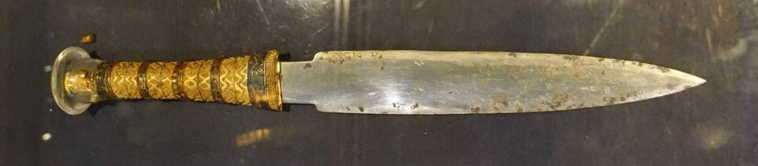
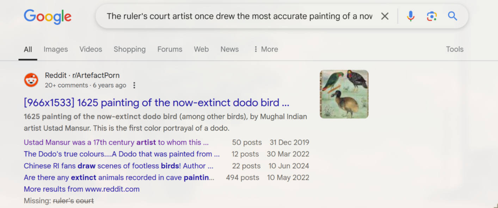
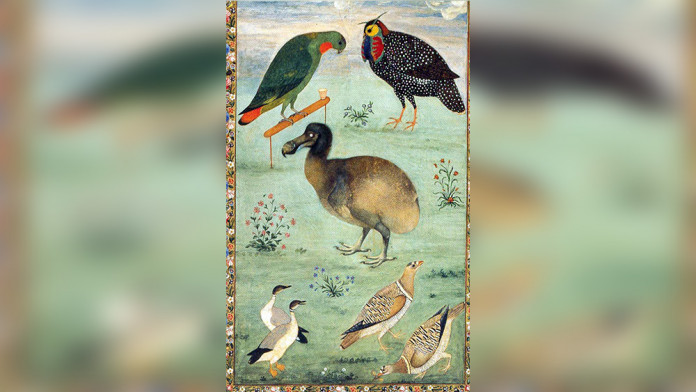
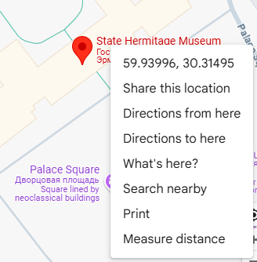

# Kings 


**Final Points:** 458 

**Author:** ScourgeXV


## Description
Did you know the cosmic weapons like this? I found similar example of such weapons on the net and it was even weirder. This ruler's court artist once drew the most accurate painting of a now extinct bird. Can you tell me the coordinates upto 4 decimal places of the place where this painting is right now.


Flag format: `KashiCTF{XX.XXXX_YY.YYYY};`

## Link -
 [Download Link](https://kashictf.iitbhucybersec.in/files/aef9ed8e2cfae1cd3f790093d74641bb/Weapon_1.jpg?token=eyJ1c2VyX2lkIjo5LCJ0ZWFtX2lkIjoxMSwiZmlsZV9pZCI6N30.Z7723A.y2siOGl20vxuQDRVOah2s3o9fQE) {Download the game from here} ==> `Weapon_01.jpg`

----
## Writeup

On downloading the jpg image,


on searching for this image I found that it belonged to King Tutankhamun of the Egyptian empire {not related }

As stated in the challenge -
```
This ruler's court artist once drew the most accurate painting of a now extinct bird.
```
on searching this on web I got - A painting of DODO bird (now extinct)


**Made by** - Ustad Mansur


On searching I got to know that this painting is kept at the - `Hermitage Museum in St. Petersberg, Russia`

on searching it on Google Maps I got -



The coordinates as
```
 latitude: 59.9399
 longitude: 30.3149
```


---
## Flag

```
KashiCTF{59.9399_30.3149}
```                 
